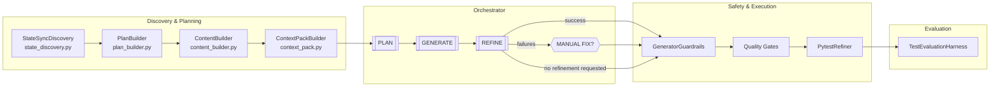
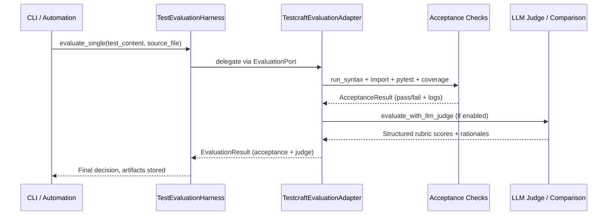

# TestCraft Pipeline Orchestration

This guide diagrams the end-to-end flow TestCraft follows from discovering candidate source files to evaluating generated tests. It focuses on the services, prompts, and quality controls that run after the CLI hands control to the generation use case.

## High-Level Flow

## Stage-by-Stage Detail

### 1. Discovery & Context Assembly

- **State sync and file discovery**: `StateSyncDiscovery.sync_and_discover` gathers prior run metadata and selects project files (`testcraft/application/generation/services/state_discovery.py:30`).
- **Coverage-aware plan construction**: `PlanBuilder.build_plans` filters low-coverage or untested source files and produces `TestGenerationPlan` objects (`testcraft/application/generation/services/plan_builder.py:26`).
- **Source context extraction**: `ContentBuilder.build_code_content` pulls precise imports and focal snippets to seed prompts (`testcraft/application/generation/services/content_builder.py:22`).
- **Context pack assembly**: `ContextPackBuilder.build_context_pack` resolves canonical imports, focal metadata, property context, and enrichment per target (`testcraft/application/generation/services/context_pack.py:37`), yielding a `ContextPack` (`testcraft/domain/models.py:560`).
- **Optional user-facing planning workflow**: `PlanUseCase.execute_planning_workflow` can present and persist plans outside the automated loop (`testcraft/application/plan_usecase.py:21`).

### 2. LLM Orchestrator (PLAN → GENERATE → REFINE)

- **PLAN stage**: `_plan_stage` issues `orchestrator_plan` prompts, parsing `{plan, missing_symbols, import_line}` JSON. Missing symbols trigger resolver retries up to `max_plan_retries` (`testcraft/application/generation/services/llm_orchestrator.py:426`).
- **GENERATE stage**: `_generate_stage` renders the approved plan plus canonical import into the `orchestrator_generate` prompt and extracts a fenced pytest module (`testcraft/application/generation/services/llm_orchestrator.py:533`).
- **REFINE stage**: `_refine_stage` loops with `orchestrator_refine` prompts when execution feedback is available, rehydrating context with any resolved symbols (`testcraft/application/generation/services/llm_orchestrator.py:573`).
- **Manual-fix branch**: When refinement cannot succeed and manual fix is enabled, `manual_fix_stage` produces a deliberately failing regression test and BUG NOTE (`testcraft/application/generation/services/llm_orchestrator.py:299`), orchestrated for end users by `ManualFixGuidanceUseCase` (`testcraft/application/manual_fix_usecase.py:41`).
- **Prompt wiring**: All stage prompts (system + user) live in `PromptRegistry` under the `orchestrator_*` keys with SAFE delimiters and structured output contracts (`testcraft/prompts/registry.py:973`).

### 3. Safety Nets & Execution Harness

- **Static guardrails**: `GeneratorGuardrails.validate_generated_test` enforces canonical imports, ORM safety, loop termination, and pytest parametrization hygiene before any write (`testcraft/application/generation/services/generator_guardrails.py:43`).
- **Quality gates**: When enriched context is available, `_run_quality_gates` spins up `QualityGatesService` (import/bootstrap/compile/determinism/coverage/mutation) using configurable toggles (`testcraft/application/generate_usecase.py:897`, `testcraft/application/generation/services/quality_gates.py:52`, `testcraft/config/models.py:686`).
- **Runtime refinement**: `PytestRefiner` executes pytest runs, captures failure traces, and coordinates iterative fixes with concurrency limits and rollback safety (`testcraft/application/generation/services/pytest_refiner.py:31`).
- **Live reporting**: `FileStatusTracker` summarizes average runtimes, highlights rollbacks, and surfaces the slowest files once generation completes (`testcraft/adapters/io/file_status_tracker.py:130`).
- **Bootstrap management**: `BootstrapRunner.ensure_bootstrap` writes conftest scaffolding or PYTHONPATH overrides when canonical imports need path adjustments (`testcraft/application/generation/services/bootstrap_runner.py:23`).

### 4. Evaluation & Feedback

- **Coverage evaluation**: `CoverageEvaluator` measures pre/post coverage and computes deltas for telemetry and quality gates (`testcraft/application/generation/services/coverage_evaluator.py:20`).
- **Evaluation harness**: `TestEvaluationHarness` wires coverage, state, LLM judging, and artifacts for single, batch, pairwise, and golden-repo assessments (`testcraft/evaluation/harness.py:28`).
- **Core adapter**: `TestcraftEvaluationAdapter` performs acceptance checks (syntax → imports → pytest → coverage) and structured LLM judging / A/B comparisons (`testcraft/adapters/evaluation/main_adapter.py:43`).
- **Evaluation prompts**: Rubric, pairwise, statistical, and bias-mitigation prompts live in `PromptRegistry` (e.g., `_system_prompt_llm_judge_v1` at `testcraft/prompts/registry.py:606`).

## Prompt Matrix

| Stage / Capability | System Prompt Key | User Prompt Key | Context Highlights |
| --- | --- | --- | --- |
| PLAN | `orchestrator_plan` (`testcraft/prompts/registry.py:973`) | `orchestrator_plan` (`testcraft/prompts/registry.py:1049`) | Canonical import, focal source/signature/docstring, resolved defs, G/W/T snippets, repo conventions |
| GENERATE | `orchestrator_generate` (`testcraft/prompts/registry.py:989`) | `orchestrator_generate` (`testcraft/prompts/registry.py:1085`) | Approved plan JSON, canonical import, property context, conventions |
| REFINE | `orchestrator_refine` (`testcraft/prompts/registry.py:1006`) | `orchestrator_refine` (`testcraft/prompts/registry.py:1115`) | Current tests, execution feedback (result/trace/coverage gaps), canonical import |
| MANUAL FIX | `orchestrator_manual_fix` (`testcraft/prompts/registry.py:1024`) | `orchestrator_manual_fix` (`testcraft/prompts/registry.py:1147`) | BUG NOTE contract, failing test requirements, THEN patterns, feedback traces |
| Evaluation LLM Judge | `llm_judge_v1` (`testcraft/prompts/registry.py:606`) | `llm_judge_v1` (`testcraft/prompts/registry.py:520`) | Rubric dimensions, sanitized test/source payloads, bias mitigation instructions |

## Configuration Touchpoints

- `OrchestratorConfig` toggles manual fix enablement plus plan/refine retry limits (`testcraft/config/models.py:470`).
- `QualityConfig` flips individual gates, determinism timeouts, and mutation sampling (`testcraft/config/models.py:686`).
- `GenerationConfig` (merged inside `GenerateUseCase`) controls batch size, refinement worker concurrency, and coverage thresholds that feed PlanBuilder decisions (`testcraft/application/generate_usecase.py:52`).
- Manual fix output paths and auto-accept policies live under the `manual_fix` section of the runtime configuration (`testcraft/application/manual_fix_usecase.py:241`).

## Evaluation Harness Flow

Use this document as the canonical reference when building E2E acceptance tests, onboarding new contributors, or reviewing prompt templates for fit-to-purpose behavior.

## End-to-End Validation

- Automated regression coverage lives in `tests/e2e/test_cli_end_to_end.py`, which launches the CLI via `uv run testcraft generate` and `testcraft evaluation ab-test` using a deterministic sitecustomize stub. The test asserts on the structured PLAN output, generated test module (including fenced python blocks and behaviour-summary comment), and the evaluation artifacts written under `.testcraft/evaluation_artifacts`.
